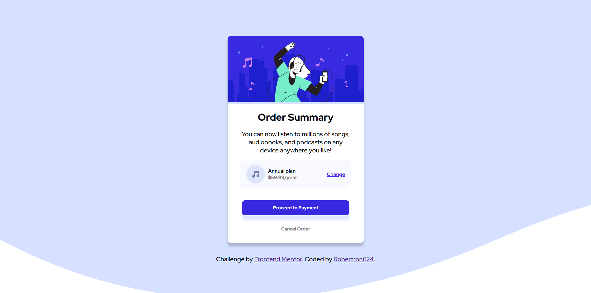

# Frontend Mentor - Order summary card solution

This is a solution to the [Order summary card challenge on Frontend Mentor](https://www.frontendmentor.io/challenges/order-summary-component-QlPmajDUj) by me Robertron624.

## Table of contents

- [Overview](#overview)
  - [The challenge](#the-challenge)
  - [Screenshot](#screenshot)
  - [Links](#links)
- [My process](#my-process)
  - [Built with](#built-with)
  - [What I learned](#what-i-learned)
  - [Continued development](#continued-development)
  - [Useful resources](#useful-resources)
- [Author](#author)

**Note: Delete this note and update the table of contents based on what sections you keep.**

## Overview

### The challenge

Users should be able to:

- See the summary card component with its proper styling and layout in desktop and mobile.

### Screenshot

### Links

- Solution URL: [Add solution URL here](https://github.com/Robertron624/order-summary-component-main)
- Live Site URL: [Add live site URL here](https://frabjous-kleicha-32ca13.netlify.app/)

## My process

### Built with

- Semantic HTML5 markup
- CSS custom properties
- Flexbox
- Mobile-first workflow

### What I learned

I used this excercise to recap over some of my HTML5 and CSS3 knowledge, mainly basic CSS like flex-box, the box-model
and css vars.

### Continued development

I want to continue my learning with adding interactivity to some components - pages either by using vanilla js if they are simple components, and if they are a little more complex components reactjs which is the framework with which I have more experience.

## Author

- Personal Website - [Robert Ramirez](https://robert-ramirez.netlify.app)
- Frontend Mentor User- [@Robertron624](https://www.frontendmentor.io/profile/Robertron624)
- Twitter - [@robertdowny](https://www.twitter.com/robertdowny)

**Note: Delete this note and add/remove/edit lines above based on what links you'd like to share.**
